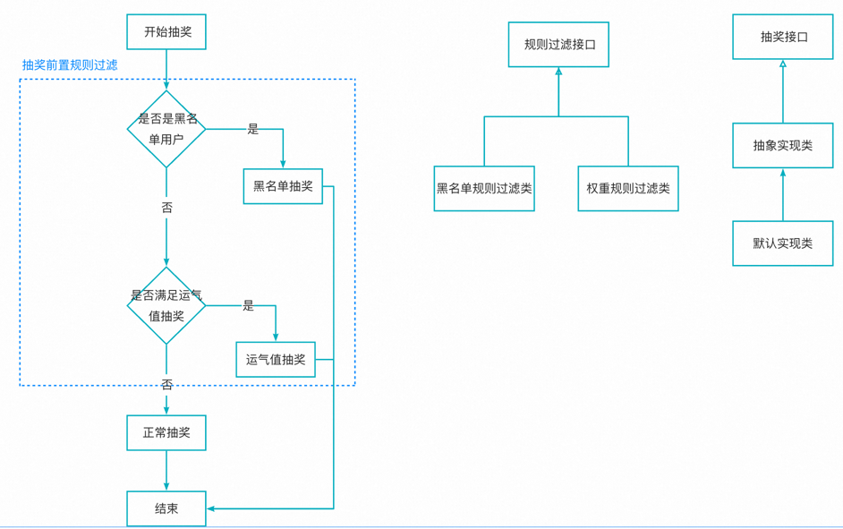
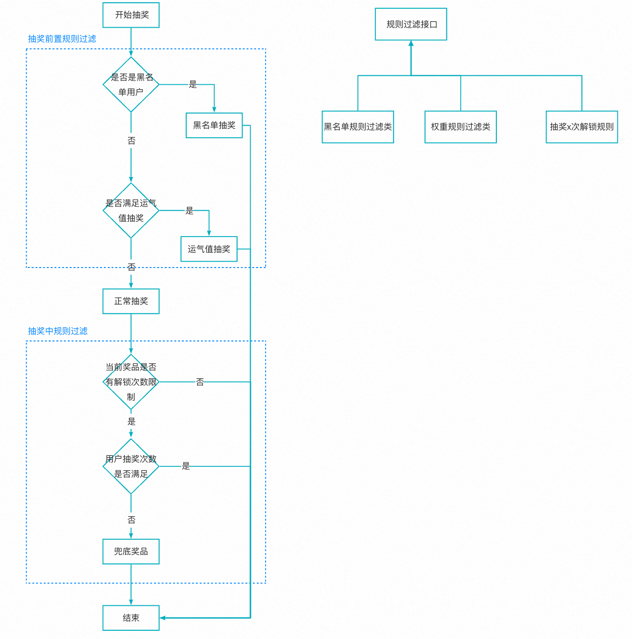
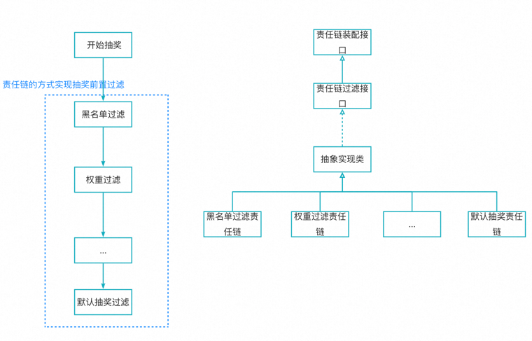
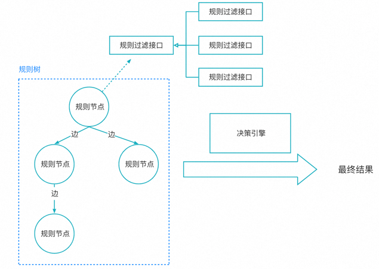
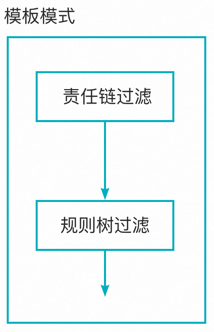
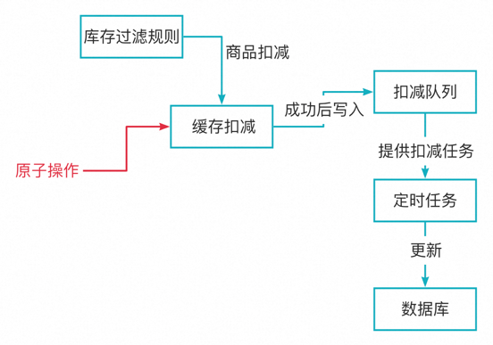
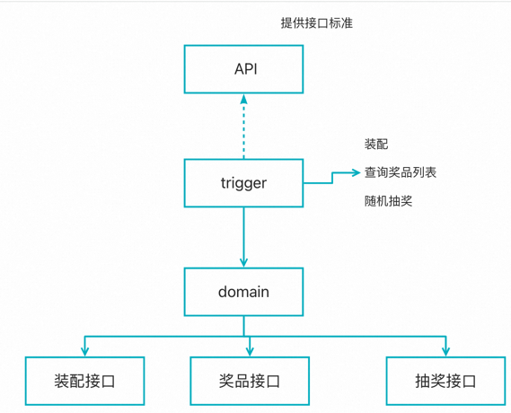
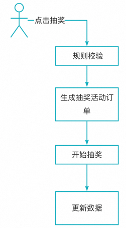

# 大营销系统平台设计

## 第一阶段-核心抽奖
### 需求分析
* 奖品有随机积分、体验卡、大模型等
* 有些奖品需要抽奖满 x 次后才能解锁抽奖
* 增加运气值，每次抽奖提升运气值，到一定阶段后必中奖

### 表设计
* 策略表: 首先是需要一张策略表，不同的活动可以对应不同的策略，然后不同策略表下可以挂载不同的奖品，概率，抽奖规则等，所以我们需要一个策略表用来隔离不同活动对应的奖品和规则等
* 奖品表: 奖品表中包含如下字段：奖品id，配置，描述
* 策略_奖品表: 挂载在策略表下的奖品表。奖品表中需要有：策略id，奖品 id，标题，中奖概率，总库存，剩余库存，还有抽奖规则类型（冗余字段，完整的信息在策略_规则表中，但这里为了减少联表查询，所以添加了这个冗余字段）
* 策略_规则表: 挂载在策略下面的规则表。规则表用来实现上述的抽奖规则，比如有些奖品是需要满3次抽奖后才能解锁抽的，还有比如运气值满了后能抽到哪些奖品等。所以规则表中需要有：策略id，规则id，奖品id（不一定需要，因为规则可以作用在整个抽奖对象上，比如运气值，而不一定是单个奖品），规则作用对象（奖品、抽奖），规则类型（解锁抽奖 lock，运气抽奖 lucky，随机积分抽奖 random），规则值

### 抽奖实现
本次抽奖策略的实现是以空间换时间，实现时间复杂度为 O(1) 的抽奖策略。具体如下，假设有如下三个奖品，对应的概率如下：

| 奖品ID      | 中奖概率 |
|-----------|------|
| 奖品A(1001) | 0.7  |
| 奖品B(1002) | 0.2  |
| 奖品C(1003) | 0.1  |

我们通过一个数组来表示奖池，里面的元素都是我们的奖品 ID，奖品的中奖概率越大，那么在数组中的元素个数越多。比如根据上述的概率，我们得到如下的数组：数组元素为 10 个，其中奖品A占据了 7 个，奖品B占据了 2 个，奖品 C 占据了 1 个，这样就实现了对应的概率

```java
int[] awardIdList = {1001, 1001, 1001, 1001, 1001, 1001, 1001, 1002, 1002, 1003};
```
为了能实现 O(1) 复杂度，我们需要将上述的数组改为 Map 结构，如下：
```
const awardMap = {
  1: 1001,
  2: 1001,
  3: 1001,
  ...
}
```
最后我们将范围数据，以及上述的 Map 表都存到 redis 中，然后我们就可以进行抽奖了，如下：
```
const range = redis.getRange(strategyId);
const random = Random.get(range);

const mapTable = redis.getMapTable(strategyId)
return mapTable[random];
```

### 抽奖运气值的实现
本章节我们实现运气值功能：用户每抽一次奖会增加一点运气值，当运气值增加到一定阈值后，必中某些奖品

上述功能的实现也比较简单，核心就是对每个运气值的档位都建立一个单独的奖池即可，比如我们将运气值划分为三个档位：4000， 5000 和 6000，那么我们可以建立 3 个奖池，在根据用户当前的运气值所属的档位来判断需要使用哪个奖池即可

### 抽奖前置规则过滤
上面我们已经实现了基本的抽奖以及根据运气值进行抽奖，但实际的抽奖业务中还会涉及到白名单，黑名单等，是一个复杂的过程。所以这一章我们重构抽奖过程，添加抽奖前规则过滤流程，并为后续的抽奖中和抽奖后流程的添加奠定基础

抽奖前的规则过滤就是先判断下当前抽奖是否满足黑名单用户，如果满足则直接走黑名单抽奖，否则判断是否满足运气值抽奖，如果满足则走运气值抽奖，都不满足时则走正常流程的抽奖。流程如下，同时我们为了能支持后续添加更多的过滤功能，比如添加白名单抽奖，这里需要将抽奖规则过滤抽象出来



我们定义规则过滤的标准接口，然后定义黑名单和权重规则类来实现这个接口

定义抽奖接口，并定义一个抽象实现类来固定抽奖的流程，然后再定义一个默认抽奖的子类来实现抽奖前置规则过滤功能

### 抽奖中规则过滤
上一章实现了抽奖前的过滤，本章在上一章的基础上添加抽奖中过滤。当用户抽奖奖品后，查询下当前奖品是否有解锁x次的规则，如果有，则判断是否满足，如果不满足则返回兜底奖品



### 责任链方式
在前置过滤的实现中，我们现在是手动处理黑名单和权重过滤的，但这种方式并不利于代码维护，所以这一章我们使用责任链的方式重构前置过滤，如下：



**注意**: 因为每个责任链内部都包含指向下一个链的节点，因此是一个有状态节点，所以这里需要修改其创建模式，改为原型模式：
```
@Scope(ConfigurableBeanFactory.SCOPE_PROTOTYPE)
```

### 抽奖规则树模型设计
上一章我们使用责任链重构了抽奖前值规则过滤，本章我们使用规则树模型来重构抽奖中和抽奖后过滤

规则树模型设计如下：
* 规则树由节点、边组成
* 每个规则节点都对应一个过滤接口，最终规则树通过决策引擎得到最终的结果
* 决策引擎执行流程如下：
  * 从根节点开始遍历
  * 遍历每个节点时，会获取该节点对应的规则过滤接口，执行规则过滤后，跟节点的边进行一一对比
  * 如果满足边的条件，则处理边的下一个节点，如果不满足当前边的条件，则取下一条边进行对比



### 模版模式串联规则
现在已经有了责任链方式处理抽奖前规则过滤，规则树模式处理抽奖中过滤，现在我们采用模版模式在抽象类中串联这两个模式，定义出抽奖的基本过程，如下：


我们先定义抽象类，实现这两个过滤规则的调用，确定了抽奖的基本流程，然后再定义一个子类，在子类中具体实现责任链过滤和规则树过滤

**注意**：本章节中的规则树的构建是从数据库中创建

### 不超卖解决库存扣减
抽奖完成后，就可以进行奖品的扣减。首先库存的扣减肯定不能直接在数据库中进行扣减，在高并发场景下，直接进行数据库扣减会导致数据库资源被耗尽，从而导致崩溃。所以在高并发场景下，一般都是需要通过 redis 先缓存商品数量，然后在 redis 中直接进行扣减，并且在扣减成功后，在异步队列中添加扣减任务，再由定时任务去完成真正的数据库扣减



**超卖问题**
缓存扣减需要是原子操作，否则在高并发场景下，会出现超卖情况。一种方式是加锁解决，但性能比较低，另一种方式是使用 redission 提供的原子操作来实现，具体看如下代码：

```java
// RedisService
public class RedisService {
  // 有并发问题的扣减
  public boolean decrBug(String key) {
    long l = redissonClient.getAtomicLong(key).get();
    if (l <= 0) {
      return false;
    }
    redissonClient.getAtomicLong(key).set(l - 1);
    return true;
  }

  // redission 提供的原子操作的扣减
  public long decr(String key) {
    return redissonClient.getAtomicLong(key).decrementAndGet();
  }
}

// Test
public class StrategyTest {
    // 如下代码中，并发调用 decrBug 进行扣减时，有并发问题，最终会有超过 100 个线程进行扣减
  public void test_stockDecr1() throws InterruptedException {
    redisService.setAtomicLong("stock", 100);
    // 保存结果
    List<Integer> list = Collections.synchronizedList(new ArrayList<>());

    CountDownLatch countDownLatch = new CountDownLatch(2000);

    for (int i = 0; i < 2000; i++) {
      new Thread(() -> {
        // 通过定时来大概对齐所有现成，模拟并发行为
        try {
          Thread.sleep(1000);
        } catch (InterruptedException e) {
          throw new RuntimeException(e);
        }
        // 执行扣减 - 这里应该会有并发问题
        boolean ret = redisService.decrBug("stock");
        // 扣减成功
        if (ret >= 0) {
          list.add(1);
        }
        countDownLatch.countDown();
      }).start();
    }

    countDownLatch.await();
    log.info("共有 {} 个线程扣减成功", list.size());
  }

  // 可以通过加锁来解决上述的并发问题，但缺点是性能比较低
  public void test_stockDecr2() throws InterruptedException {
    redisService.setAtomicLong("stock", 100);
    // 保存结果
    List<Integer> list = Collections.synchronizedList(new ArrayList<>());

    CountDownLatch countDownLatch = new CountDownLatch(2000);

    for (int i = 0; i < 2000; i++) {
      new Thread(() -> {
        // 通过定时来大概对齐所有现成，模拟并发行为
        try {
          Thread.sleep(1000);
        } catch (InterruptedException e) {
          throw new RuntimeException(e);
        }

        boolean ret;
        // 加锁解决这里的并发问题
        synchronized (this) {
          ret = redisService.decrBug("stock");
        }
        // 扣减成功
        if (ret) {
          list.add(1);
        }
        countDownLatch.countDown();
      }).start();
    }

    countDownLatch.await();
    log.info("共有 {} 个线程扣减成功", list.size());
  }

  // redission 提供了原子操作，可以不加锁也能解决并发问题，如下
  public void test_stockDecr3() throws InterruptedException {
    redisService.setAtomicLong("stock", 100);
    // 保存结果
    List<Integer> list = Collections.synchronizedList(new ArrayList<>());

    CountDownLatch countDownLatch = new CountDownLatch(2000);

    for (int i = 0; i < 2000; i++) {
      new Thread(() -> {
        // 通过定时来大概对齐所有现成，模拟并发行为
        try {
          Thread.sleep(1000);
        } catch (InterruptedException e) {
          throw new RuntimeException(e);
        }

        // 使用 redission 提供的原子操作解决并发问题
        long ret = redisService.decr("stock");
        // 扣减成功
        if (ret >= 0) {
          list.add(1);
        }
        countDownLatch.countDown();
      }).start();
    }

    countDownLatch.await();
    log.info("共有 {} 个线程扣减成功", list.size());
  }

}

```

### 抽奖 API 接口实现
根据 DDD 中的模块分工，在 api 模块中提供对外接口的标准，在 trigger 模块中统一提供 http 接口、定时任务等对外处理，domain 领域模块提供领域的实现，模块的依赖关系如下：



同时为了代码维护方便，我们在 domain 领域模块中再添加一个奖品接口，提供奖品查询结果

**注意**
* 奖品列表的数据不会经常变更，因此需要添加到缓存中，提升性能

### 部署 && 压测
我们使用 docker 来部署前后端，并生产对应的镜像文件

## 第二阶段-抽奖活动

### 需求描述
* 通过抽奖活动来包装抽奖，并且有库存限制，每次抽奖次数限制等
* 用户个人账户中有抽奖次数，每次抽奖都需要消耗次数，当次数不足时不能抽奖

上一阶段已经实现了抽奖的核心功能，这一阶段我们通过对抽奖进行包装后对外提供。我们使用活动的概念来包装抽奖。我们需要先创建一个抽奖活动，然后才能邀请用户过来抽奖，一个抽奖活动有开始时间，结束时间，并且有抽奖次数的限制，库存的限制等用来实现抽奖的各种限制。

对于用户而言，首先会有一个专门的个人账户用来保存当前的抽奖次数。用户想要抽奖的话，就需要消耗抽奖次数，同时这个抽奖次数会有每日的限制、每月的限制等。当用户当天还有次数时，点击抽奖后，会先生成一个抽奖订单也就是一次抽奖对应一个抽奖订单，然后会进行实际的抽奖，并在抽奖结束后更新用户账户的次数，订单状态等。上述的抽奖活动总结如下：


### 表设计
根据上述抽奖活动需求的描述，设计如下 5 张表：
* 抽奖活动表(raffle_activity)：用来配置抽奖活动的。包括如下字段：活动 ID、活动名称、活动描述、次数配置 ID、活动开始时间、下线时间、总库存、剩余库存、抽奖策略、状态
* 抽奖次数配置表(raffle_activity_count)：用来配置抽奖次数。包括如下字段：次数配置 ID、总次数、每天次数、每月次数
* 用户活动订单表(raffle_activity_order)：用户每进行一次抽奖都会生成一个对应的订单表，当抽奖失败后，后续还可以通过订单表来重新发起抽奖。字段如下：用户 ID、活动 ID、订单 ID、状态
* 活动次数账户表(raffle_activity_account)：用户当前账户的活动次数。每次抽奖都会消耗活动次数，用户也可以通过其他方式增加活动次数。当次数消耗完后，用户就无法参与抽奖，并且还规定了每天能抽奖的次数上限等。包括的字段：用户 ID、活动 ID、总次数、剩余次数、日次数、日剩余次数、月次数、月剩余次数
* 账户次数流水表(raffle_activity_account_flow)：记录用户每一次的次数变更的流水表。包括的字段：用户 ID、流水 ID、活动 ID、次数编号、业务 ID
